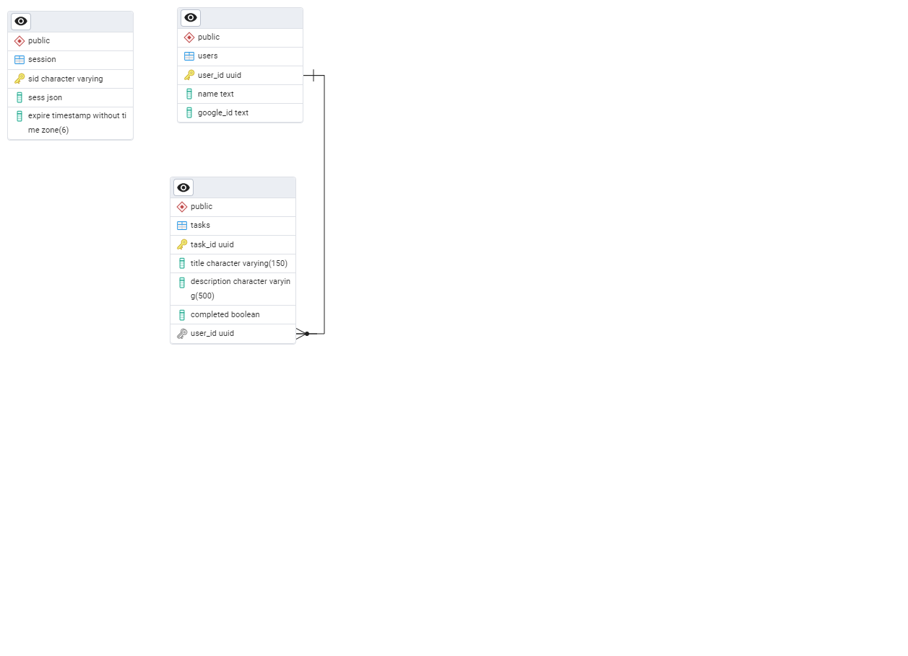

# simple-task-app-databse
* create_database.sql - Script for creating the simple_task_app database in PostgresSql.

The script was created as a schema backup generated from this command:
> pg_dump -h \<host> -p \<port> -U \<user (postgres)> -s -c -C -d simple_task_app -f create_database.sql

To use the script to build the database:
> psql -U \<user (postgres)> -f create_database.sql

The server's access to the database is done through the POSTGRES_URI environment variable of the form:
> POSTGRES_URI=postgres://{username}:{password}@{hostname}:{port}/{database}

When deploying the Postgres database with Fly.io, but using the server elsewhere, you need to [enable external connections](https://fly.io/docs/postgres/connecting/connecting-external/) for the Postgres app. 

